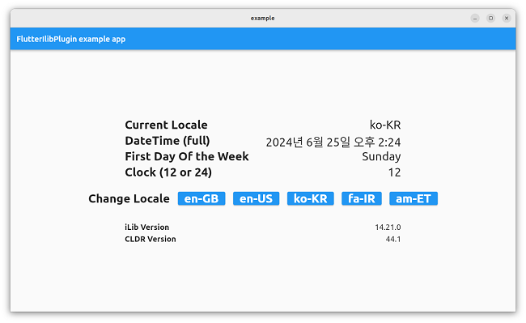

# flutter_ilib

A wrapper plugin to conveniently use [iLib](https://github.com/iLib-js/iLib) in Flutter app.  
The iLib is an internationalization library written in pure JavaScript.  
This plugin uses the [flutter_js](https://pub.dev/packages/flutter_js) to make the JavaScript file work properly in the Flutter app.

## How to use
### Initialization
Add the following import.
```dart
import 'package:flutter_ilib/flutter_ilib.dart';
```
Add a listener to get a callback message that ilib is ready to use.

```dart
final FlutterILib _flutterIlibPlugin = FlutterILib.instance;
_flutterIlibPlugin.addListener(() {
    // do Something.
});
```

### Updating the locale
Since version **v1.0.0**, the structure has been updated to load locale data only for the currently activated locale.  
when the app is launched, the package automatically loads the locale data by detecting the system's locale.  
To load the updated locale data file when the locale changes, I suggest adding the following method at the appropriate time when the locale chanages.  

``` _flutterIlibPlugin.loadLocaleData(curLocale);```  

Here is an example of using the [localeResolutionCallback](https://api.flutter.dev/flutter/widgets/WidgetsApp/localeResolutionCallback.html)  property.  
i.e:
```dart
Locale? appLocaleResolutionCallback(
      Locale? locale,
      Iterable<Locale> supportedLocales,
    ) {
      ...
      _flutterIlibPlugin.loadLocaleData(locale);
      ...
    }
```
```dart
@override
Widget build(BuildContext context) {
....
    return MaterialApp(
        ....
        localeResolutionCallback: appLocaleResolutionCallback,
    ....
```

### Formatting
Get the result of formatting by using the class provided by flutter_ilib.

```dart
final ILibDateFmtOptions fmtOptions = ILibDateFmtOptions(
    locale: 'ko-KR',
    length: 'short',
    useNative: false,
    timezone: 'local');
final ILibDateFmt fmt = ILibDateFmt(fmtOptions);
final ILibDateOptions dateOptions = ILibDateOptions(
    year: 2024,
    month: 6,
    day: 27,
    hour: 13,
    minute: 45,
    second: 0,
    millisecond: 0);
fmt.format(dateOptions);
// '24. 6. 27.'
```

```dart
final ILibDateFmtOptions fmtOptions = ILibDateFmtOptions(
    locale: 'ko-KR',
    length: 'full',
    type: 'datetime',
    useNative: false,
    timezone: 'local');
final ILibDateFmt fmt = ILibDateFmt(fmtOptions);
final ILibDateOptions dateOptions =
    ILibDateOptions(dateTime: DateTime.parse('2024-06-27 10:42'));
fmt.format(dateOptions);
// '2024년 6월 27일 오전 10:42'
```

```dart
// 0:sun, 1:mon, 2:tue, 3:wed, 4:thu, 5:fri, 6:sat
final ILibLocaleInfo locInfo = ILibLocaleInfo('ko-KR');
locInfo.getFirstDayOfWeek();
// 0
locInfo.getWeekEndStart();
// 6
locInfo.getWeekEndEnd();
// 0
```

## CLASS

### FlutterILib
- Methods: `evaluateILib()` :
    It allows to use any class of APIs from ILib.   
    Convert the Javascript code you want to get as a result into a string and pass it as an argument.
```dart
String lo = 'am-ET';
String jscode1 = 'new LocaleInfo("$lo").getCalendar()';
_flutterIlibPlugin.evaluateILib(jscode1);
// 'ethiopic'
```
To give a more efficient way, we provide some classes that can be easily used in a Flutter app.   
Currently, We have a `ILibDateFmt` and `ILibLocaleInfo` classes.
We have a plan to provide more classes and methods.  

### ILibDateFmt
- Class: [ILibDateOptions](./Docs.md/#ilibdateoptions)
- Class: [ILibDateFmtOptions](./Docs.md/#ilibdatefmtoptions)  
- Class: [ILibDateFmt](./Docs.md#ilibdatefmt)
   - Methods: `format()`, `getClock()`, `getTemplate()`, `getMeridiemsRange()`

### ILibLocaleInfo
- Class: [ILibLocaleInfo](./Docs.md/#iliblocaleinfo)
   - Methods:  `getFirstDayOfWeek()`, `getWeekEndStart()`, `getWeekEndStart()` 

## Supported Locales
The results of the following locales are checked by unit tests.  
They have the same result as the original iLib methods.

```text
af-ZA,am-ET,ar-AE,ar-EG,ar-IQ,ar-MA,ar-SA,as-IN,az-Latn-AZ,bg-BG,bn-IN,    
bs-Latn-BA,bs-Latn-ME,cs-CZ,da-DK,de-AT,de-CH,de-DE,de-LU,el-CY,el-GR, 
en-AM,en-AU,en-AZ,en-CA,en-CN,en-GB,en-GE,en-GH,en-HK,en-IE,en-IN,en-IS,  
en-JP,en-KE,en-LK,en-MM,en-MW,en-MX,en-MY,en-NG,en-NZ,en-PH,en-PR,en-SG,  
en-TW,en-UG,en-US,en-ZA,en-ZM,es-AR,es-BO,es-CA,es-CL,es-CO,es-DO,es-EC,  
es-ES,es-GT,es-HN,es-MX,es-NI,es-PA,es-PE,es-PR,es-PY,es-SV,es-US,es-UY,  
es-VE,et-EE,fa-IR,fi-FI,fr-BE,fr-CA,fr-CH,fr-FR,fr-LU,ga-IE,gu-IN,ha-Latn-NG,  
he-IL,hi-IN,hr-HR,hr-ME,hu-HU,id-ID,is-IS,it-CH,it-IT,ja-JP,kk-Cyrl-KZ,km-KH,  
kn-IN,ko-KR,ko-US,ku-Arab-IQ,lt-LT,lv-LV,mk-MK,ml-IN,mn-Cyrl-MN,mr-IN,ms-MY,  
nb-NO,nl-BE,nl-NL,or-IN,pa-IN,pl-PL,pt-BR,pt-PT,ro-RO,ru-BY,ru-GE,ru-KG,ru-KZ,  
ru-RU,ru-UA,si-LK,sk-SK,sl-SI,sq-AL,sq-ME,sr-Latn-ME,sr-Latn-RS,sv-FI,sv-SE,  
sw-Latn-KE,ta-IN,te-IN,th-TH,tr-AM,tr-AZ,tr-CY,tr-TR,uk-UA,ur-IN,uz-Latn-UZ,  
vi-VN,zh-Hans-CN,zh-Hant-HK,zh-Hant-TW
```

## Supported Platforms
* Linux
* webOS

## TEST
### Run the Unit Test
On Linux, you need to export an environment variable called `LIBQUICKJSC_TEST_PATH` pointing to the file `libquickjs_c_bridge_plugin.so`.

```
export LIBQUICKJSC_TEST_PATH="${PWD}/test/linux/libquickjs_c_bridge_plugin.so"
flutter test test/flutter_ilib_test.dart
```
We have the script file for the above works to do everything at once.

```
./execute_unit_test.sh
```
> **Note**  
> Logging behavior has been updated and logs are printed by default during tests.  
> To suppress verbose logs during testing, add `--dart-define=TEST_MODE=true` option.  
> In this mode, only logs with **warning level or higher** will be printed.

### Excute the example
We provide the example app that can be executed.
```
cd example
flutter build linux --release
flutter run -d linux --release
```


## License

Copyright (c) 2024-2026, JEDLSoft

This plugin is license under Apache2. See the [LICENSE](./LICENSE)
file for more details.
