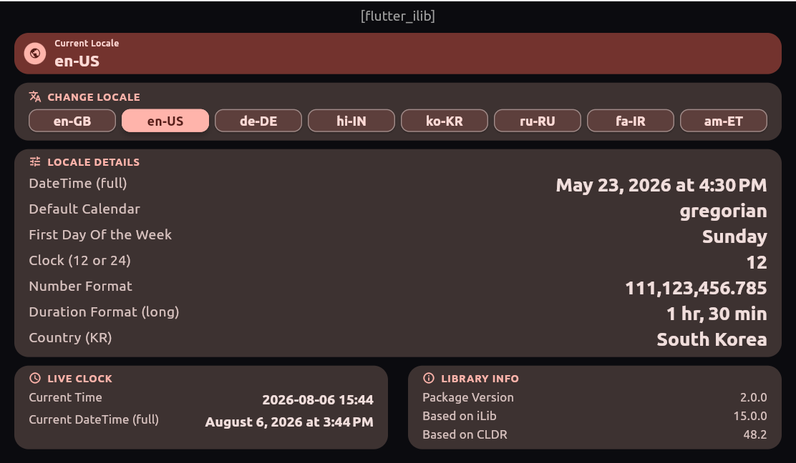

# flutter_ilib

A Flutter plugin that brings [iLib](https://github.com/iLib-js/iLib)'s internationalization (i18n)
to Flutter apps — locale-aware date/number/duration formatting, calendars, case mapping, and
locale information.

- **v1.x**: ran the iLib JavaScript library through the
  [flutter_js](https://pub.dev/packages/flutter_js) engine.
- **v2.0+**: the JavaScript interop is removed. flutter_ilib is implemented in pure Dart and reads
  iLib's CLDR-based locale data (JSON) directly, so no JavaScript runtime (and no `flutter_js`
  dependency) is needed.

> The change is internal only — the public API is the same across major versions, so your usage
> code does not need to change when upgrading from v1.x to v2.0.

The Dart implementation and the bundled locale data are based on **iLib v15.0.0** (which
incorporates **CLDR 48.2**).

## 📚 Documentation

For detailed documentation, see the **[docs/](./docs/)** folder:

- **[Quick Reference](./docs/quick_reference.md)** - Get started with key APIs and common patterns
- **[Architecture](./docs/architecture.md)** - Understand the system design and data flow
- **[API Reference](./docs/api.md)** - Complete API documentation for all classes
- **[Development Guide](./docs/development.md)** - Setup, testing, and contribution guidelines
- **[Documentation Index](./docs/INDEX.md)** - Navigation guide for all documentation

## How to use
### Initialization
Add the following import.
```dart
import 'package:flutter_ilib/flutter_ilib.dart';
```
Add a listener to get a callback message that ilib is ready to use.

```dart
final FlutterILib _flutterIlibPlugin = FlutterILib.instance;
_flutterIlibPlugin.addListener(() {
    // do Something.
});
```

### Updating the locale
Since version **v1.0.0**, the structure has been updated to load locale data only for the currently activated locale.  
when the app is launched, the package automatically loads the locale data by detecting the system's locale.  
To load the updated locale data file when the locale changes, I suggest adding the following method at the appropriate time when the locale chanages.  

``` _flutterIlibPlugin.loadLocaleData(curLocale);```  

Here is an example of using the [localeResolutionCallback](https://api.flutter.dev/flutter/widgets/WidgetsApp/localeResolutionCallback.html)  property.  
i.e:
```dart
Locale? appLocaleResolutionCallback(
      Locale? locale,
      Iterable<Locale> supportedLocales,
    ) {
      ...
      _flutterIlibPlugin.loadLocaleData(locale);
      ...
    }
```
```dart
@override
Widget build(BuildContext context) {
....
    return MaterialApp(
        ....
        localeResolutionCallback: appLocaleResolutionCallback,
    ....
```

### Examples
Get the result of formatting by using the class provided by flutter_ilib.

### Date Formatting

```dart
final ILibDateFmtOptions fmtOptions = ILibDateFmtOptions(
    locale: 'ko-KR',
    length: 'short',
    useNative: false,
    timezone: 'local');
final ILibDateFmt fmt = ILibDateFmt(fmtOptions);
final ILibDateOptions dateOptions = ILibDateOptions(
    year: 2024,
    month: 6,
    day: 27,
    hour: 13,
    minute: 45,
    second: 0,
    millisecond: 0);
fmt.format(dateOptions);
// '24. 6. 27.'
```

```dart
final ILibDateFmtOptions fmtOptions = ILibDateFmtOptions(
    locale: 'ko-KR',
    length: 'full',
    type: 'datetime',
    useNative: false,
    timezone: 'local');
final ILibDateFmt fmt = ILibDateFmt(fmtOptions);
final ILibDateOptions dateOptions =
    ILibDateOptions(dateTime: DateTime.parse('2024-06-27 10:42'));
fmt.format(dateOptions);
// '2024년 6월 27일 오전 10:42'
```

> **Note on `timezone: 'local'`:** `'local'` resolves to the device's DST-aware system time
> zone (matching iLib's JS), so it differs from `'Etc/UTC'` on a non-UTC host. An omitted
> timezone defaults to `'local'`. See
> [docs/local-timezone-support.md](docs/local-timezone-support.md) for details.

### Duration Formatting

```dart
final ILibDurationFmtOptions fmtOptions =
    ILibDurationFmtOptions(locale: 'en-GB', length: 'full');
final ILibDurationFmt fmt = ILibDurationFmt(fmtOptions);
final ILibDateOptions dateOptions = ILibDateOptions(
    year: 1, month: 1, week: 1, day: 1, hour: 1, minute: 1);
fmt.format(dateOptions);
// '1 year, 1 month, 1 week, 1 day, 1 hour, 1 minute'

final ILibDurationFmtOptions fmtOptions = ILibDurationFmtOptions(
      locale: 'en-GB',
      length: 'full',
      style: 'clock',
    );
final ILibDurationFmt fmt = ILibDurationFmt(fmtOptions);
final ILibDateOptions dateOptions = ILibDateOptions(
    year: 2, month: 2, week: 2, day: 2, hour: 2, minute: 2);
fmt.format(dateOptions);
// '2 years, 2 months, 2 weeks, 2 days, 02:02'
```

### LocaleInfo

```dart
// 0:sun, 1:mon, 2:tue, 3:wed, 4:thu, 5:fri, 6:sat
final ILibLocaleInfo locInfo = ILibLocaleInfo('ko-KR');
locInfo.getFirstDayOfWeek();
// 0
locInfo.getWeekEndStart();
// 6
locInfo.getWeekEndEnd();
// 0

locInfo.getDecimalSeparator();
// '.'
locInfo.getGroupingSeparator();
// ','
locInfo.getPercentageFormat();
// '{n}%'
locInfo.getNegativePercentageFormat();
// '-{n}%'
locInfo.getCurrencyFormats().common;
// {s}{n}
locInfo.getCurrency();
// 'KRW'

final ILibLocale locale = locInfo.getLocale();
locale.getLanguage();
// 'ko'
```

### Number Formatting

```dart
final ILibNumFmtOptions fmtOptions = ILibNumFmtOptions(
  locale: 'en-US',
  type: 'currency',
  currency: 'USD',
  maxFractionDigits: 2,
  minFractionDigits: 2,
  roundingMode: 'halfup',
);
final ILibNumFmt fmt = ILibNumFmt(fmtOptions);
fmt.format(1234567.89);
// '$1,234,567.89'
fmt.format(-1234567.89);
// '-$1,234,567.89'
```

### Calendar Date

```dart
// Gregorian
final ILibDateOptions date = ILibDateOptions(
    year: 2024, month: 6, day: 27, hour: 13, minute: 45);
date.getYears();   // 2024
date.getMonths();  // 6
date.getDays();    // 27
date.getDayOfWeek(); // 4 (Thursday)
date.getCalendar();  // 'gregorian'
```

### Calendar Meta

```dart
// Thai Solar (year = Gregorian + 543)
final ILibCalendar cal = ThaiSolarCal();
cal.getNumMonths(2567);     // 12
cal.getMonLength(2, 2555);  // 29 (leap year)
cal.isLeapYear(2555);       // true
cal.isLeapYear(2554);       // false
```

### Calendar Formatting

```dart
// Persian calendar (fa-IR)
final ILibDateFmtOptions fmtOptions = ILibDateFmtOptions(
    locale: 'fa-IR',
    length: 'long',
    useNative: false);
final ILibDateFmt fmt = ILibDateFmt(fmtOptions);
final ILibDateOptions dateOptions = ILibDateOptions(
    locale: 'fa-IR',
    year: 1392,
    month: 9,
    day: 21);
fmt.format(dateOptions);
// '‏21 آذر 1392'
```

```dart
// Ethiopic calendar (am-ET)
final ILibDateFmtOptions fmtOptions = ILibDateFmtOptions(
    locale: 'am-ET',
    length: 'medium');
final ILibDateFmt fmt = ILibDateFmt(fmtOptions);
final ILibDateOptions dateOptions = ILibDateOptions(
    locale: 'am-ET',
    year: 2011,
    month: 9,
    day: 29);
fmt.format(dateOptions);
// '29 ግንቦት 2011'
```

## ScriptInfo
```dart
final ILibLocaleInfo locInfo = ILibLocaleInfo('en-US');
final ILibScriptInfo scInfo = ILibScriptInfo(locInfo.getScript());
scInfo.getCode();
//'Latn'
scInfo.getName();
// 'Latin'
scInfo.getScriptDirection();
// 'ltr'
```

## CaseMapper
``` dart
final ILibCaseMapper mapper = ILibCaseMapper(locale: 'tr-TR');
mapper.map('ıi');
// 'Iİ'
final ILibCaseMapper mapper = ILibCaseMapper(
    locale: 'tr-TR', direction: 'tolower');
mapper.map('Iİ');
// 'ıi'
```

## Country
``` dart
final ILibCountry ctry = ILibCountry(locale: 'ko-KR');
ctry.getName('TR');
// '튀르키예'
ctry.getCode('튀르키예');
// 'TR'
```

## Supported Locales
The results of the following locales are checked by unit tests.  
They have the same result as the original iLib methods.

```text
af-ZA,am-ET,ar-AE,ar-EG,ar-IQ,ar-MA,ar-SA,as-IN,az-Latn-AZ,bg-BG,bn-IN,    
bs-Latn-BA,bs-Latn-ME,cs-CZ,da-DK,de-AT,de-CH,de-DE,de-LU,el-CY,el-GR, 
en-AM,en-AU,en-AZ,en-CA,en-CN,en-GB,en-GE,en-GH,en-HK,en-IE,en-IN,en-IS,  
en-JP,en-KE,en-LK,en-MM,en-MW,en-MX,en-MY,en-NG,en-NZ,en-PH,en-PR,en-SG,  
en-TW,en-UG,en-US,en-ZA,en-ZM,es-AR,es-BO,es-CA,es-CL,es-CO,es-DO,es-EC,  
es-ES,es-GT,es-HN,es-MX,es-NI,es-PA,es-PE,es-PR,es-PY,es-SV,es-US,es-UY,  
es-VE,et-EE,fa-IR,fi-FI,fr-BE,fr-CA,fr-CH,fr-FR,fr-LU,ga-IE,gu-IN,ha-Latn-NG,  
he-IL,hi-IN,hr-HR,hr-ME,hu-HU,id-ID,is-IS,it-CH,it-IT,ja-JP,kk-Cyrl-KZ,km-KH,  
kn-IN,ko-KR,ko-US,ku-Arab-IQ,lt-LT,lv-LV,mk-MK,ml-IN,mn-Cyrl-MN,mr-IN,ms-MY,  
nb-NO,nl-BE,nl-NL,or-IN,pa-IN,pl-PL,pt-BR,pt-PT,ro-RO,ru-BY,ru-GE,ru-KG,ru-KZ,  
ru-RU,ru-UA,si-LK,sk-SK,sl-SI,sq-AL,sq-ME,sr-Latn-ME,sr-Latn-RS,sv-FI,sv-SE,  
sw-Latn-KE,ta-IN,te-IN,th-TH,tr-AM,tr-AZ,tr-CY,tr-TR,uk-UA,ur-IN,uz-Latn-UZ,  
vi-VN,zh-Hans-CN,zh-Hant-HK,zh-Hant-TW
```

## Supported Platforms
* Linux
* webOS

## TEST
### Run the Unit Test

**v2.0+**: tests run in pure Dart — no JavaScript bridge or environment variable is required.

```
flutter test
```

**v1.x**: required a QuickJS bridge. On Linux you had to export `LIBQUICKJSC_TEST_PATH` pointing to
`libquickjs_c_bridge_plugin.so` before running the tests:

```
export LIBQUICKJSC_TEST_PATH="${PWD}/test/linux/libquickjs_c_bridge_plugin.so"
flutter test test/flutter_ilib_test.dart
```

> **Note**  
> Logging behavior has been updated and logs are printed by default during tests.  
> To suppress verbose logs during testing, add `--dart-define=TEST_MODE=true` option.  
> In this mode, only logs with **warning level or higher** will be printed.

### Excute the example
We provide the example app that can be executed.
```
cd example
flutter build linux --release
flutter run -d linux --release
```


## License

Copyright (c) 2024-2026, JEDLSoft

This plugin is license under Apache2. See the [LICENSE](./LICENSE)
file for more details.
